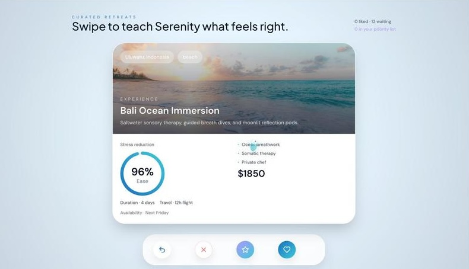
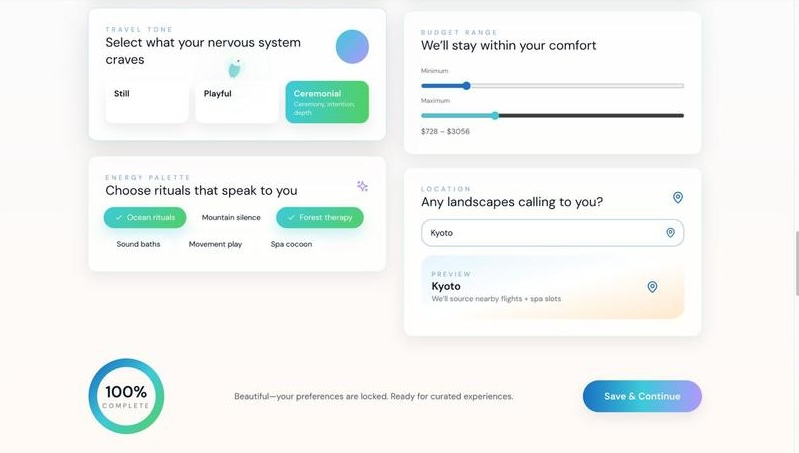
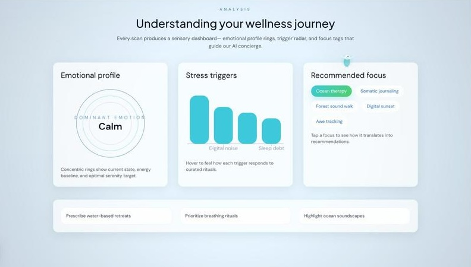

# **Rest Quest**

> 🧘 Presented at the **GreatUniHack 2025**
> 🥉 3rd Place in the Booking.com Challenge

---

## 🚀 Overview

  
**Rest Quest** is a dual-surface, emotion-aware concierge that closes the gap between how travelers feel and how they plan wellness escapes. The React SPA delivers a cinematic, tactile journey from emotional check-in to curated retreat decks, while the Python toolkit captures facial cues, transcribes live audio with ElevenLabs, and asks Gemini-powered follow-ups that feel like a human concierge. Together they reduce decision fatigue, surface hyper-personal rituals, and keep every interaction privacy-aware on-device.

---

## 💡 Core Features

### 🌊 Emotionally Intelligent Hero

  

- FlowPattern ribbons, ParticleField fog, and an animated RestQuestLogo breathe with the guest.
- AmbientCursor + CinematicJourney sync gradients, parallax focus, and SpiritBird trails as visitors scroll.

### 🧠 Emotional Check-In & Analysis Lab

  

- Glassmorphic journal chat with empathy typing, ambient soundscapes, and breathing overlay (press `Space`).
- `mockEmotionAnalysis` transforms journal text into stress/energy/valence scores powering RadialProgress gauges, trigger bar charts (Recharts), and focus-tag recommendations.

### 🎯 Conversational Preferences & Recommendation Deck

  

- `PreferencesContext` stores travel moods, ritual pace, destination search, and intensity sliders with celebratory micro-interactions via Framer Motion.
- Tinder-style swipe deck driven by `useCardSwipe`, @use-gesture/react, undo history, “Learn More” modals, and priority lists for premium retreats.

### 🧘‍♀️ Celebration, Booking, and Ritual Wrap-Up

- Booking Summary compares saved experiences, opens itinerary modals, and highlights priority tags.
- CelebrationSection fires particle bursts, breathing cues, and CTA buttons once enough likes are tracked.

### 🎥 Emotion & Voice Toolkit (Python)

- `project/camera.py` mixes OpenCV, MediaPipe, DeepFace, and FER fallback to log emotion spectrums per answer.
- ElevenLabs STT/TTS + Gemini prompts (via `elabs1.py` and `gemini_client1.py`) capture, transcribe, and narrate follow-up questions and travel suggestions in seconds.
- Mock mode lets teams demo the flow without heavy ML dependencies or API keys.

---

## 🏗️ Tech Stack

| Layer | Technologies |
|:------|:-------------|
| **Frontend Runtime** | React 18, Vite, JSX, Context API |
| **Styling & Motion** | Tailwind CSS, custom globals, Framer Motion, @react-spring/web |
| **Interaction** | @use-gesture/react, Lottie-react, Lucide-react, Recharts |
| **State & Data** | EmotionalContext, PreferencesContext, ExperiencesContext, localStorage |
| **Toolkit Runtime** | Python 3.10+, OpenCV, MediaPipe, DeepFace, FER, TensorFlow 2.15 |
| **Speech & LLM** | ElevenLabs STT/TTS SDK, Google Gemini (Flash Lite), dotenv |
| **Audio & I/O** | sounddevice, numpy, threading warmups, mock video fallbacks |

---

## 🧠 Why Rest Quest Stands Out

✅ **Full-sensory UI** — cinematic gradients, particle fog, and SpiritBird trails respond to every section.  
✅ **Emotion-first recommendations** — keyword analysis drives biometrics, triggers, and retreat focus tags.  
✅ **Swipeable concierge** — likes, super-likes, undo, and saved-match overlays mirror best-in-class travel apps.  
✅ **On-device privacy** — journaling stays local; Python toolkit runs camera + audio processing without cloud uploads.  
✅ **LLM-guided empathy** — Gemini follow-ups adopt a calm, concierge tone powered by reproducible prompts.  
✅ **Inclusive interactions** — reduced-motion support, keyboard controls, ambient sound toggles, and screen-reader friendly structure.  

---

## 🏅 Wellness Milestones

| **Milestone** | **Criteria** |
|---------------|--------------|
| First Breath | Complete the Emotional Check-In journey |
| Ritual Curator | Save 3+ experiences to the liked stack |
| Priority Seeker | Mark at least two retreats as priority |
| Breathing Master | Trigger the breathing overlay three times via `Space` |
| Globe Collector | Explore five destination suggestions in Preferences |
| Calm Analyst | Unlock the Analysis Lab after two journal submissions |
| Celebration Spark | Reach CelebrationSection with ≥3 liked retreats |

---

## 🌐 Guest Journey

1. **Landing Ritual** – FlowPattern hero, breathing orb, and CTA to “Begin Emotional Scan.”  
2. **Emotional Check-In** – Guests journal or speak; AI echo responds with quantified stress + guidance.  
3. **Preferences Dialogue** – Sliders, pills, and suggestions capture mood, pace, and desired rituals.  
4. **Analysis Lab** – Concentric biometrics, trigger charts, and focus tags explain the AI diagnosis.  
5. **Recommendation Deck** – Swipeable cards with gesture, keyboard, and modal controls capture intent.  
6. **Booking & Celebration** – Saved stack becomes comparison tables, itinerary modals, and celebratory cues.  
7. **Emotion CLI** – Optional live session logs facial cues + transcripts for concierge follow-up.  

---

## 🔮 Future Enhancements

- 🩺 **Live sentiment fusion** — pipe ElevenLabs/Gemini transcripts directly into the SPA’s `EmotionalContext`.  
- 📍 **Geo-personalized content** — integrate map previews and flight sourcing for each retreat card.  
- 🎧 **Adaptive soundscapes** — sync AmbientSoundscape layers with real stress/energy telemetry.  
- ☁️ **Persistent profiles** — push liked stacks and questionnaires to Supabase / Firestore for multi-device continuity.  
- 📊 **Session analytics dashboard** — render `project/emotion_results.jsonl` inside the SPA for concierge review.  
- 📱 **Companion mobile shell** — wrap the SPA in Capacitor/Expo for in-resort kiosks.  
